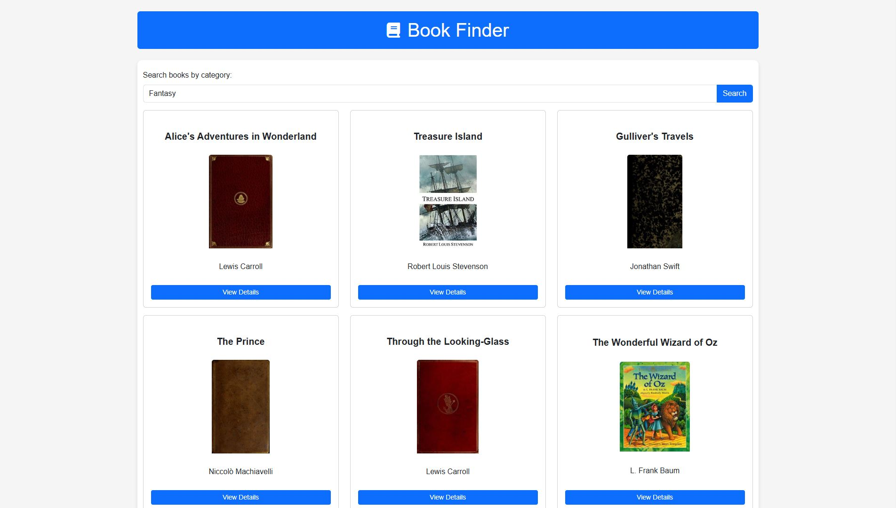

# Book Finder

## About The Project

Book Finder is a web application designed to help users discover books based on their favorite categories. Using the Open Library API, it fetches a curated list of books and displays their details, such as title, author, and cover. Users can also view more information about each book through an interactive modal.

## Features

- Search books by category.
- View book details in a responsive modal.
- Displays book cover, title, and author.
- Easy-to-use and responsive interface.

## Built With

- **HTML** - For structuring the content.
- **CSS** - For styling the application and enhancing the UI.
- **JavaScript** - For interactive functionality and API integration.
- **Bootstrap** - For responsive design and pre-styled components.
- **Open Library API** - For fetching book data.

## Usage

1. Open the application in your browser.
2. Enter a book category (e.g., "fantasy") in the search bar.
3. Click the **Search** button to retrieve books.
4. Browse the results and click **View Details** to learn more about a book.

### Live Demo

Access the project online:
- [Book Finder on GitHub Pages](https://lincoln711.github.io/javascript-library/)
- [Book Finder on Netlify](https://easy-javascript-library.netlify.app/)

## Contact

For questions or feedback, feel free to reach out:

- **Name**: Simone Bruno
- **Email**: simonebruno433@gmail.com
- **GitHub**: [Lincoln711](https://github.com/Lincoln711)
